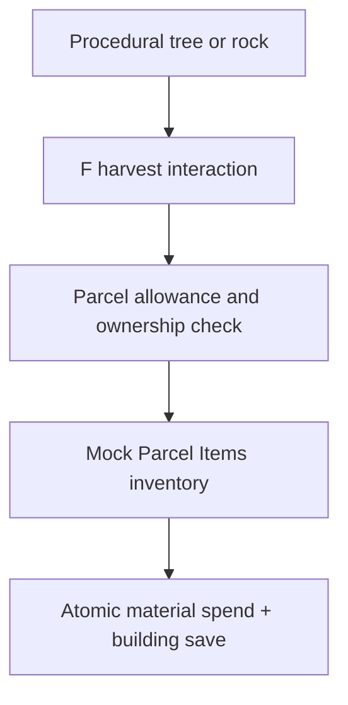

# Mock resource economy

Run `npm run dev:mock`, open the URL printed by Vite with `/?tokenId=742`, and click **Use mock owner**. The default mock owner controls parcels 742, 743 and 744.

- In movement mode, aim at a procedural tree or rock within five world units and press **F**.
- Trees yield wood; rocks yield stone. Open **I** to inspect inventory.
- Open **B** to see a piece's material cost and place it. Insufficient balances reject placement.
- Only the current parcel owner may harvest or build. Procedural scenery remains visible; this is an allowance prototype, without chopping animations or individual tree depletion.

## Allowances and persistence

Each parcel starts with 40 wood and 40 stone available. A harvest claims up to four units. Both resources share a two-second harvest cooldown; each reserve independently replenishes one unit every 30 seconds up to 40. All trees share the parcel's wood reserve, and all rocks share its stone reserve. Walking to another tree does not reset it.

Reserves and cooldowns belong to the parcel and survive refreshes and mock land transfers. The seller keeps harvested materials already in their wallet; the buyer inherits the remaining reserve and existing buildings. Moving the browser clock backward does not create credit, but localStorage and the local clock are editable: mock mode is not an enforceable token economy.

The existing mock Parcel Items ledger stores materials, allowances and migrated buildings in one localStorage record. Its mutation lock serializes changes where Web Locks are available. A successful construction debits materials and saves the object in one write; a failed storage write commits neither. Existing buildings are lazily imported from their legacy parcel records without retroactive charges. Legacy records are retained as backups. Do not run older mock clients against this migrated state.

Removing objects gives no refunds, including buildings created before material costs existed. The existing development inventory grant remains available for testing.

## Costs

| Piece | Wood | Stone |
| --- | ---: | ---: |
| Foundation | 8 | 4 |
| Wall, doorway, window wall | 4 | 2 |
| Roof | 6 | 2 |
| Standing lantern | 2 | 2 |
| Entrance stairs | 4 | 2 |
| Story stairs | 8 | 4 |
| Decorative tree | 4 | 0 |
| Decorative rock | 0 | 4 |

Legacy cube/platform/pillar provider operations cost 2/2, 6/2 and 0/4 respectively. Portals, locked doors and containers use separate state providers and have no material cost in this prototype. Attached assets and instruments retain their existing custody rules.

## Provider boundary

`HarvestProvider` exposes reserve reads and harvest claims. `MockEconomy` implements it together with the existing `ParcelStateStore`; the renderer does not manage balances. Cost and allowance constants live in `app/src/economy/model.ts`. Procedural meshes receive interaction tags only: terrain height, scenery positions and seeded generation are unchanged. User-placed trees and rocks are not harvesting targets.

## Future onchain implementation

The deployed Base contracts are unchanged. Onchain mode has no resource allowance or construction material charge from this prototype. A future contract should enforce current parcel ownership, replenishment, cooldowns and atomic minting/spending using chain time. Terrain meshes need not be generated or stored onchain. The contract would authorize a resource claim, not prove that a player swung an axe, stood near a tree or spent time in the browser. If those actions must become enforceable, they need a separate trust/proof design.

Runtime tests cover depletion, cooldowns, refill caps, backward clocks, ownership changes, unchanged terrain, persistence, insufficient materials, atomic storage failures, legacy buildings and removal without refunds.
