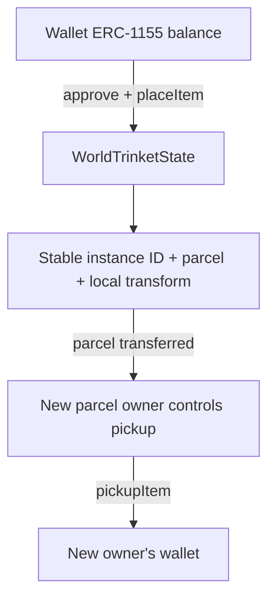

# Trinkets in the world

Doodverse Trinkets are a separate ERC-1155 collection. Their IDs never refer to Parcel Items or Keys.

## Use

Open Inventory [I], choose **Trinkets**, select an instrument, and approve the **Trinket escrow**. Set quantity to 1 and choose **Place near player** while standing on a parcel you own. Instruments are placed four meters ahead, within that parcel, with their base on deterministic terrain. Aim at the instrument and press **E** to collect it. Move it by collecting and placing it again. The UI also supports wallet transfers and refreshing balances.

The five models are Afterhours (DJ board), Nocturne 88 (keyboard), Backbeat (drums), Prism (xylophone), and Barrio (bongos). Aim at an instrument within interaction range and left-click to open its playable controls. Anyone nearby can play; E remains restricted to owner pickup. The panel pauses player movement and closing it unloads the instrument and stops its audio. Playback changes no custody state and requires no transaction. The five authored instrument pages are bundled as lazy-loaded assets, inside a scripts-only sandbox; arbitrary NFT animation URLs are never opened. Closing during a load prevents late content from starting. Placement inside NFT containers and elevated building-floor placement are not implemented yet.

## Custody and ownership

WorldTrinketState is additive: no original contract was replaced. It has immutable parcel and Trinket collection bindings, no admin withdrawal function, and accepts only deposits initiated by its placement method. Unsolicited single/batch safe transfers revert. The expected receiver callback, location write and token transfer happen atomically. Failed withdrawals roll back, and reentrant withdrawals are rejected.

One instance holds exactly one token of one of IDs 1–5. Each parcel holds up to 64 instances; IDs are monotonically increasing and removal uses swap-and-pop without changing surviving IDs. Coordinates use centimeters (200–6200 inclusive), rotation uses hundredths of a degree (0–35999). The 2m safety radius contains every model at any rotation. Model scale is presentation only; state does not depend on metadata or remote scripts.

Parcel sale leaves the instrument in escrow at its original location. Only the current ERC-721 parcel owner may collect it. Depositor is provenance, not withdrawal authority. The previous owner's unrelated balances are unchanged. Wallet inventory and parcel custody cannot contain the same token unit simultaneously.

## Providers and rendering

`MockTrinketProvider` uses a separate localStorage namespace with atomic balance/location commits. Mock owners can grant the selected instrument from inventory. `OnchainTrinketProvider` validates the escrow bindings and shares the existing transaction/wallet APIs. Each provider returns the existing item placement shape but remains explicitly separate from Parcel Items. Inventory approval always targets the selected collection's escrow.

The existing ExperienceLayer streams neighboring Trinket attachments and removes scene roots on unload. TrinketRegistry loads each of the five bundled GLBs once per runtime, shares its geometry/materials across clones, and disposes them when the registry shuts down. Late loads after disposal are released. Failed model loads retain a small visible fallback; canonical custody remains available for pickup. NFT showcase views also include Trinkets.

`node scripts/export-trinket-models.mjs` exports trusted geometry sections from the repository's original instrument sources. It excludes audio, event listeners, render loops, and canvas text labels. No external HTML or animation_url is executed. Output lives in `app/src/trinkets/models/` and Vite fingerprints the assets. Geometry is centered, grounded and normalized to a 3.2m bounding-box diagonal. Models load only when their instrument is present.

## Base configuration

- Trinkets: `0x32CEb50081fD7e986cd32231b01157b45FD20B51`
- WorldTrinketState: [0x502c6B27dB570Fb2D6ed2670b00457cc3CD58f61](https://basescan.org/address/0x502c6B27dB570Fb2D6ed2670b00457cc3CD58f61#code), verified
- `VITE_DOODVERSE_TRINKETS_ADDRESS` selects the token collection.
- `VITE_WORLD_TRINKET_STATE_ADDRESS` selects its custody contract.
- The standard production build loads both from `docs/deployments/doodverse-base.env.example`; no Vercel secret is needed.

[Deployment receipt](deployments/world-trinket-state-base.json). Scripts `deploy-trinket-state.mjs` and `verify-trinket-state.mjs` are specific to this additive Base deployment. Deployment journals remain ignored; keys must never be placed in VITE variables. PublicNode reads fall back to Base's RPC when the public endpoint rejects a receipt/pending lookup.

## Validation

Runtime coverage includes separate mock balances, persistence, transfer inheritance, invalid placement, repeated pickup, neighboring parcel unload, model bounds and grounded geometry. Foundry covers authorization, unsolicited deposits, rollback on a rejecting receiver, reentrant pickup, stable IDs, capacity and fuzzed coordinate/rotation/type validation. The fresh-suite integration exercises the actual onchain provider's approval, placement, land transfer, old-owner rejection and buyer pickup on a local chain. These tests are not an independent security audit.
